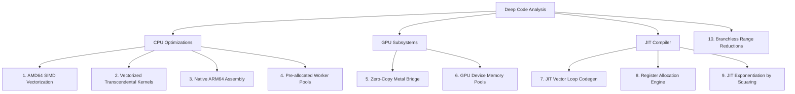

# Next Steps: Performance Optimization Roadmap & 10-Part Improvement Plan

This document outlines the architectural and performance improvements plan for the `emlgo` math library based on a deep-dive analysis of the CPU, GPU, and JIT compilation subsystems.

---

## 10-Part Improvement Plan

### 1. AVX2 & AVX512 Vectorization for Scalar & Unary Batch Ops
* **Current State:** Unary/scalar batch operations (e.g. `AddScalarSIMD`, `MulScalarSIMD`, `SqrtSIMD`, `AbsSIMD`, `NegSIMD`, `InvSIMD`) in `internal/eml/simd_dispatch_amd64.go` are implemented using plain Go loops.
* **Proposed Plan:** Rewrite these wrappers to call hand-tuned AVX2/AVX512 assembly kernels. Vectorizing unary ops (e.g., using `VSQRTPD` or bitwise masks for `VANDPD` absolute values) will unlock substantial throughput gains for large slices on x86_64.

### 2. AVX2 & AVX512 Vectorized Transcendental Batch Kernels
* **Current State:** Batch transcendental functions (`Exp`, `Log`, `Sin`, `Cos`, `Tan`) are parallelized using goroutines but run scalar math code on each thread.
* **Proposed Plan:** Implement vectorized minimax approximations directly inside the AVX2/AVX512 assembly files. Processing 4 (AVX2) or 8 (AVX512) `float64` values per instruction using fused multiply-add (`VFMADD213PD`) will remove the scalar transcendental bottleneck.

### 3. Native ARM64 NEON & SVE/SVE2 Assembly Kernels
* **Current State:** `internal/eml/simd_arm64.s` is empty. The SVE and NEON dispatchers in `simd_arm64.go` simulate SIMD execution using plain Go loops.
* **Proposed Plan:** 
  - Write hand-tuned ARM64 NEON assembly kernels utilizing 2-wide `float64` registers (e.g., `FADD`, `FMUL`, `FSQRT`).
  - Implement native Vector-Length Agnostic (VLA) SVE assembly kernels utilizing predicate registers (`P0-P7`) to support scalable vector architectures on Graviton and Apple Silicon chips.

### 4. Reusable Thread Worker Pool for Batch Parallelization [COMPLETED]
* **Current State:** Implemented. A channel-based lock-free worker pool is pre-allocated at package init based on the number of CPU cores.
* **Implementation details:** Replaced dynamic `sync.WaitGroup` goroutine spawning in `parallelizeGeneric` and `parallelizeSinCos` with job queues dispatched to pre-started worker threads. Small payloads bypass the pool to execute synchronously without channel overhead.

### 5. Zero-Copy Metal GPU Bridge & Pipeline Cache
* **Current State:** The Metal C bridge (`internal/gpu/metal_bridge.m`) performs synchronous heap allocations, explicitly casts `double` to `float` (and back) on the CPU, compiles compute pipelines on every launch, and uses blocking command buffer waits.
* **Proposed Plan:**
  - Create a static pipeline state cache during initialization to avoid rebuilding compute pipelines on every run.
  - Implement double-precision shader execution (`double` type in Metal) to eliminate CPU-side float/double conversions.
  - Switch to async command queues and double-buffering to allow overlapping GPU execution with host calculations.

### 6. Zero-Allocation GPU Device Memory Pool (CUDA) [COMPLETED]
* **Current State:** Implemented. A thread-safe device memory allocator/pool buffers device pointers in Go.
* **Implementation details:** The CUDA bridge uses a mutex-protected slice (`pool`) to cache and reuse `unsafe.Pointer` handles for device memory. The driver allocation overhead (`eml_allocate`) is reduced to zero for successive iterations of short GPU pipelines. Memory is gracefully released back to the driver during package shutdown.

### 7. Vectorized Loop Code Generation in JIT Compiler
* **Current State:** The JIT compiler (`internal/jit/codegen.go`) only compiles expressions to execute on a single scalar `float64` input.
* **Proposed Plan:** Extend the JIT compilation engine to accept `[]float64` slices. The compiled machine code should emit a structured loop that handles loop setup, iterates over slice chunks using AVX2 or AVX512 registers, and performs remainder handling—allowing runtime-compiled mathematical expressions to run at full SIMD speeds.

### 8. Register Allocation Engine for JIT Codegen [COMPLETED]
* **Current State:** Implemented. The JIT engine now uses a simple register allocation tracker utilizing scratch registers `xmm0` through `xmm14` (excluding `xmm15` reserved for variable `x`).
* **Implementation details:** The tree evaluation is register-based, avoiding stack pushes/pops entirely for standard-depth expressions and falling back gracefully on exhaustion.

### 9. JIT Exponentiation by Squaring (Binary Exponentiation) [COMPLETED]
* **Current State:** Implemented.
* **Implementation details:** Exponentiation is unrolled using a binary exponentiation algorithm. Powers of 2 require $O(\log n)$ squarings and 0 accumulator moves. Non-powers of 2 use `xmm1` as a temporary accumulator, completing in $O(\log n)$ multiplications without stack traffic.

### 10. High-Accuracy branchless Cody-Waite Range Reductions in FastMath
* **Current State:** `pkg/fastmath` functions revert to standard library `math.Sin` or `math.Cos` fallbacks for values outside $[-\pi/2, \pi/2]$.
* **Proposed Plan:** Replace fallbacks with a branchless Cody-Waite range reduction scheme. High-degree minimax polynomials optimized with the Remez algorithm can then compute accurate trigonometric and transcendental approximations across the entire range with sub-5-ULP error margins while avoiding standard library context-switch overheads.
