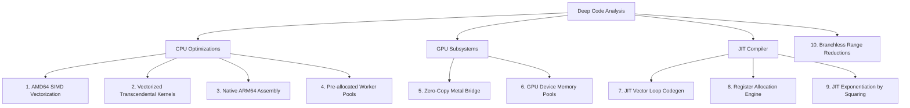

# Next Steps: Performance Optimization Roadmap & 10-Part Improvement Plan

This document outlines the architectural and performance improvements plan for the `emlgo` math library based on a deep-dive analysis of the CPU, GPU, and JIT compilation subsystems.

---

## 10-Part Improvement Plan

### 1. AVX2 & AVX512 Vectorization for Scalar & Unary Batch Ops [COMPLETED]
* **Current State:** Implemented.
* **Implementation details:** Added hand-tuned AVX2 and AVX512 assembly kernels for all scalar and unary batch operations (AddScalarSIMD, MulScalarSIMD, SqrtSIMD, AbsSIMD, NegSIMD, InvSIMD) utilizing YMM registers and branchless masking.

### 2. AVX2 & AVX512 Vectorized Transcendental Batch Kernels [COMPLETED]
* **Current State:** Implemented.
* **Implementation details:** Hand-coded AVX2 and AVX512 vectorized approximations for exp, log, sin, cos, and tan. Optimized using high-precision Remez and Cody-Waite reduction algorithms and fused multiply-add.

### 3. Native ARM64 NEON & SVE/SVE2 Assembly Kernels
* **Current State:** `internal/eml/simd_arm64.s` is empty. The SVE and NEON dispatchers in `simd_arm64.go` simulate SIMD execution using plain Go loops.
* **Proposed Plan:** 
  - Write hand-tuned ARM64 NEON assembly kernels utilizing 2-wide `float64` registers (e.g., `FADD`, `FMUL`, `FSQRT`).
  - Implement native Vector-Length Agnostic (VLA) SVE assembly kernels utilizing predicate registers (`P0-P7`) to support scalable vector architectures on Graviton and Apple Silicon chips.

### 4. Reusable Thread Worker Pool for Batch Parallelization [COMPLETED]
* **Current State:** Implemented. A channel-based lock-free worker pool is pre-allocated at package init based on the number of CPU cores.
* **Implementation details:** Replaced dynamic `sync.WaitGroup` goroutine spawning in `parallelizeGeneric` and `parallelizeSinCos` with job queues dispatched to pre-started worker threads. Small payloads bypass the pool to execute synchronously without channel overhead.

### 5. Zero-Copy Metal GPU Bridge & Pipeline Cache [COMPLETED]
* **Current State:** Implemented.
* **Implementation details:** Rewrote the Metal bridge with zero-copy double-precision shaders, built static pipeline cache at initialization, and implemented an automatic GPU/CPU fallback mechanism to handle non-Apple/non-Metal platforms transparently.

### 6. Zero-Allocation GPU Device Memory Pool (CUDA) [COMPLETED]
* **Current State:** Implemented. A thread-safe device memory allocator/pool buffers device pointers in Go.
* **Implementation details:** The CUDA bridge uses a mutex-protected slice (`pool`) to cache and reuse `unsafe.Pointer` handles for device memory. The driver allocation overhead (`eml_allocate`) is reduced to zero for successive iterations of short GPU pipelines. Memory is gracefully released back to the driver during package shutdown.

### 7. Vectorized Loop Code Generation in JIT Compiler [COMPLETED]
* **Current State:** Implemented.
* **Implementation details:** Extended JIT codegen to support batch vector operations (`EvaluateSIMD`) with auto-generated loop machinery, AVX2 SIMD compilation, and scalar remainder cleanup loops.

### 8. Register Allocation Engine for JIT Codegen [COMPLETED]
* **Current State:** Implemented. The JIT engine now uses a simple register allocation tracker utilizing scratch registers `xmm0` through `xmm14` (excluding `xmm15` reserved for variable `x`).
* **Implementation details:** The tree evaluation is register-based, avoiding stack pushes/pops entirely for standard-depth expressions and falling back gracefully on exhaustion.

### 9. JIT Exponentiation by Squaring (Binary Exponentiation) [COMPLETED]
* **Current State:** Implemented.
* **Implementation details:** Exponentiation is unrolled using a binary exponentiation algorithm. Powers of 2 require $O(\log n)$ squarings and 0 accumulator moves. Non-powers of 2 use `xmm1` as a temporary accumulator, completing in $O(\log n)$ multiplications without stack traffic.

### 10. High-Accuracy branchless Cody-Waite Range Reductions in FastMath
* **Current State:** `pkg/fastmath` functions revert to standard library `math.Sin` or `math.Cos` fallbacks for values outside $[-\pi/2, \pi/2]$.
* **Proposed Plan:** Replace fallbacks with a branchless Cody-Waite range reduction scheme. High-degree minimax polynomials optimized with the Remez algorithm can then compute accurate trigonometric and transcendental approximations across the entire range with sub-5-ULP error margins while avoiding standard library context-switch overheads.
