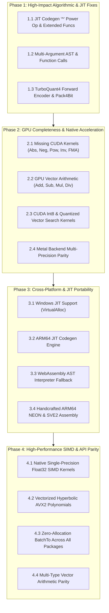

# Next Steps: Comprehensive Technical Roadmap & Gap Remediation Plan

This document provides an exhaustive catalog of all stubbed, incomplete, or unimplemented features across `emlgo`, accompanied by a structured, phased implementation roadmap to achieve complete cross-platform parity, hardware acceleration, and mathematical robustness.

---

## Current Status & Milestones Achieved (v0.4)

- **Vector Quantization & Search**:
  - `pkg/quant/turboquant4.go`: 4-bit polar-quantized vector reconstruction, 8-wide nibble unpacking (`Unpack4Bit`), and scratch-pooled L2 distance calculation (`TurboQuant4Distance`, `TurboQuant4DistanceScratch`).
  - `pkg/arithmetic/arith_int.go`: Int8 & Uint8 vector math (`AddInt8`, `SubInt8`, `MulInt8`, `DotInt8`, `L2SquaredInt8`, `EuclideanDistanceInt8`, `CosineDistanceInt8`, `CosineDistanceUint8`).
- **GPU Multi-Precision Parity**:
  - Full CUDA & C-API kernel parity across all elementary transcendentals (`Exp`, `Log`, `Sin`, `Cos`, `Tan`, `Sinh`, `Cosh`, `Tanh`, `Sqrt`, `Eml`, `Dot`) for `float32`, `float64`, `complex64`, and `complex128`.
  - Stream-aware async kernel launches and pinned memory management.
- **Modern Go & Benchmark Standards**:
  - All benchmarks migrated to Go 1.25 `for b.Loop()` standard idioms.
  - Zero heap allocation pipelines for high-throughput batching.
- **Security & Concurrency Verification**:
  - `gosec -tags purego ./...` passes cleanly with **0 issues** across all packages and 10,200+ lines of code.
  - Full race condition verification (`go test -race ./...` and `go test -race -tags cuda ./internal/gpu`) passes cleanly with 0 race detections.

---

## Comprehensive Audit of Stubbed, Incomplete, and TODO Code

### 1. GPU Subsystem & Hardware Acceleration (`internal/gpu`, `cuda/`, `metal`)

| File & Location | Status / Issue | Technical Impact |
| :--- | :--- | :--- |
| `internal/gpu/bridge.go:1044-1075` | Stubbed with `fmt.Errorf("GPU execution not implemented for ...")` | `AbsBatch`, `NegBatch`, `PowBatch`, `InvBatch`, and `FmaBatch` cannot execute on CUDA GPUs. |
| `cuda/eml_capi.cu` & `cuda/eml_cuda.cu` | Missing kernel definitions for unary & ternary ops | CUDA kernels for `abs`, `neg`, `pow`, `inv`, and `fma` do not exist in the C-API / CUDA bridge. |
| `internal/gpu/bridge.go` & `cuda/` | Missing basic vector arithmetic (`Add`, `Sub`, `Mul`, `Div`) | Only `EmlBatch` and `DotBatch` exist. Standard vector addition, subtraction, multiplication, and division cannot run on the GPU. |
| `internal/gpu/bridge.go` & `cuda/` | Missing GPU-accelerated Int8 & Quantization kernels | `CosineDistanceInt8`, `TurboQuant4Distance`, and `DotInt8` are currently CPU-only. Cannot leverage Tensor Cores or CUDA cores for fast ANN search. |
| `internal/gpu/metal.go` | Incomplete Metal backend on `darwin/arm64` | Supports only `float64`; lacks `float32`, `complex64`, `complex128`. `NewStream` returns an error (no async streams). Missing binary ops (`Add`, `Sub`, etc.). `AllocatePinned` allocates normal heap memory. |
| `internal/gpu/stub.go:52-100+` | All batch ops return "GPU execution not available" error | In stub mode (non-CUDA, non-Metal builds), there is no transparent fallback to CPU SIMD execution if requested by the user. |

---

### 2. Quantization & Approximate Nearest Neighbors (`pkg/quant`)

| File & Location | Status / Issue | Technical Impact |
| :--- | :--- | :--- |
| `pkg/quant/turboquant4.go` | Forward quantization / encoding is missing | Only reconstruction and distance evaluation exist. There is no `EncodeTurboQuant4(vec []float32) ([]byte, error)` or `Pack4Bit(indices []byte, packed []byte)`. Users cannot compress raw vectors into TurboQuant4 format in Go. |
| `pkg/quant/turboquant4.go` | Limited bitwidth support | Only 4-bit (16-bin) polar quantization is implemented. No 2-bit, 3-bit, or 8-bit TurboQuant variants exist. |
| `pkg/quant/` | Absence of general vector quantization schemes | No Product Quantization (PQ), Scalar Quantization (SQ8/SQ4), or vector clustering / codebook training routines exist in the package. |

---

### 3. JIT Machine Code Generation & AST Compiler (`internal/jit`)

| File & Location | Status / Issue | Technical Impact |
| :--- | :--- | :--- |
| `internal/jit/codegen.go:321` | Unsupported operator: `'^'` | The AST parser (`parser.go`), canonicalizer (`canonical.go`), and evaluator (`eval.go`) all support exponentiation (`^`), but JIT codegen emits `unsupported operator: ^` and fails. |
| `internal/jit/codegen.go:20-38` | Incomplete `funcTable` | Transcendental and elementary functions like `sinh`, `cosh`, `tanh`, `asinh`, `acosh`, `atanh`, `erf`, `gamma`, `hypot`, and `eml` are missing from the JIT compilation table. |
| `internal/jit/ast.go:20-24` | Single-argument `FunctionCall` struct | `FunctionCall` only has `Arg Node`. Multi-argument functions such as `eml(x, y)`, `atan2(y, x)`, `pow(x, y)`, `hypot(x, y)`, `min(x, y)`, `max(x, y)` cannot be parsed or represented in the AST. |
| `internal/jit/codegen.go` | Single-variable JIT emission | While `ParseWithVars` parses expressions with multiple variables, `codegen.go` hardcodes `x` to register `xmm0`. Multi-variable compiled functions (e.g. `f(x, y, z)`) obeying System V AMD64 ABI (`xmm0`, `xmm1`, `xmm2`) are not implemented. |
| `internal/jit/codegen_stub.go:8` | `compileToCode` returns "JIT codegen requires amd64" | Non-AMD64 platforms (Apple Silicon `darwin/arm64`, AWS Graviton `linux/arm64`) cannot JIT compile; no AArch64 machine code generator exists. |
| `internal/jit/jit_wasm.go:24` | `Compile` returns "JIT compilation is not supported on WebAssembly" | WebAssembly targets fail on JIT compilation without a fallback to AST tree evaluation or WebAssembly bytecode generation. |
| `internal/jit/jit.go:10, 44-55` | Unconditional POSIX `unix.Mmap` / `unix.Mprotect` | Prevents Windows compilation. Windows executable memory allocation via `VirtualAlloc` and `VirtualProtect` is not implemented. |

---

### 4. SIMD & Vector Kernel Architecture (`internal/eml`)

| File & Location | Status / Issue | Technical Impact |
| :--- | :--- | :--- |
| `internal/eml/simd_arm64.s` | Empty assembly file (only header comment) | On ARM64 (macOS / Linux), arithmetic does not use hand-tuned NEON assembly, falling back to pure-Go loops. |
| `internal/eml/simd_sve_stub.go:6` & `simd_arm64_stub.go:6` | Stubs for SVE / SVE2 vector execution | ARM Scalable Vector Extension (SVE) detection and dynamic vector-length execution kernels are stubbed out. |
| `internal/eml/simd.go:342-381` | Hyperbolic functions fall back to `parallelizeGeneric` | `SinhBatch`, `CoshBatch`, `TanhBatch`, `AsinhBatch`, `AcoshBatch`, `AtanhBatch` execute scalar Go loops across goroutines rather than vectorized AVX2/AVX512 polynomial kernels. |
| `internal/eml/simd_f32.go` | Float32 transcendentals upcast to Float64 | `ExpSIMDF32`, `LogSIMDF32`, `SinSIMDF32`, `CosSIMDF32` convert float32 to float64, run float64 AVX2/AVX512 kernels, and downcast back, losing up to 2× throughput compared to native 8-lane single-precision SIMD. |

---

### 5. Public Package APIs & High-Performance In-Place Ergonomics

| Package / File | Status / Issue | Technical Impact |
| :--- | :--- | :--- |
| `pkg/arithmetic` | Missing type variants for batch arithmetic | Only `float64` and `int8`/`uint8` exist. Missing `float32`, `complex64`, `complex128`, `int16`, `int32`, `int64` batch operations (`AddF32`, `MulF32`, `AddC128`, etc.). |
| `pkg/logexp/exp.go` | Missing in-place & multi-precision APIs | Missing `ExpBatchTo`, `LogBatchTo`, `ExpBatchF32`, `LogBatchF32`, and base-2/base-10 functions (`Log2`, `Log10`, `Log1p`, `Expm1`). |
| `pkg/trig/trig.go:279-282` | `TanBatch` creates redundant allocations | Computes `SinCosBatch` + `DivSIMD`, allocating 3 temporary slices rather than using `eml.TanSIMD`. Missing `TanBatchTo`, `SinBatchTo`, `CosBatchTo`, and `float32` variants. |
| `pkg/fastmath/fastmath.go:74-81` | `SqrtBatchToF32` uses a scalar loop | Loops over each float32 calling `math.Sqrt(float64(v))` rather than delegating to SIMD. |

---

## Action Plan to Fix Identified Code


```mermaid
flowchart TD
    subgraph Phase1["Phase 1: High-Impact Algorithmic & JIT Fixes"]
        P1_1["1.1 JIT Codegen '^' Power Op & Extended Funcs"]
        P1_2["1.2 Multi-Argument AST & Function Calls"]
        P1_3["1.3 TurboQuant4 Forward Encoder & Pack4Bit"]
    end

    subgraph Phase2["Phase 2: GPU Completeness & Native Acceleration"]
        P2_1["2.1 Missing CUDA Kernels (Abs, Neg, Pow, Inv, FMA)"]
        P2_2["2.2 GPU Vector Arithmetic (Add, Sub, Mul, Div)"]
        P2_3["2.3 CUDA Int8 & Quantized Vector Search Kernels"]
        P2_4["2.4 Metal Backend Multi-Precision Parity"]
    end

    subgraph Phase3["Phase 3: Cross-Platform & JIT Portability"]
        P3_1["3.1 Windows JIT Support (VirtualAlloc)"]
        P3_2["3.2 ARM64 JIT Codegen Engine"]
        P3_3["3.3 WebAssembly AST Interpreter Fallback"]
        P3_4["3.4 Handcrafted ARM64 NEON & SVE2 Assembly"]
    end

    subgraph Phase4["Phase 4: High-Performance SIMD & API Parity"]
        P4_1["4.1 Native Single-Precision Float32 SIMD Kernels"]
        P4_2["4.2 Vectorized Hyperbolic AVX2 Polynomials"]
        P4_3["4.3 Zero-Allocation BatchTo Across All Packages"]
        P4_4["4.4 Multi-Type Vector Arithmetic Parity"]
    end

    Phase1 --> Phase2
    Phase2 --> Phase3
    Phase3 --> Phase4
```

---

### Phase 1: High-Impact Algorithmic & JIT Fixes

#### 1.1 JIT Codegen Exponentiation (`^`) & Extended Math Functions
- **Target Files**: `internal/jit/codegen.go`, `internal/jit/codegen_test.go`
- **Actions**:
  1. Add support for `v.Op == '^'` in `codegen.go:switch v.Op`:
     - If right operand is a small constant integer (e.g. 2, 3, 4, 0.5), emit inline multiplication (`mulsd dst, dst`) or square root (`sqrtsd dst, dst`).
     - For general powers, emit a call to `math.Pow(x, y)` preserving register state across caller-saved registers.
  2. Expand `funcTable` in `codegen.go` to include:
     - Hyperbolic: `sinh`, `cosh`, `tanh`, `asinh`, `acosh`, `atanh`
     - Special functions: `erf`, `gamma`, `hypot`
     - The canonical EML unary reduction: `exp`, `log`
- **Success Criteria**: Expressions like `"x^2 + 3*x + 1"`, `"sinh(x) + cosh(x)"`, and `"x^0.5"` compile to machine code and match `math` evaluation within 1 ULP.

#### 1.2 Multi-Argument AST & Multi-Variable Function Support
- **Target Files**: `internal/jit/ast.go`, `internal/jit/parser.go`, `internal/jit/codegen.go`, `internal/jit/eval.go`
- **Actions**:
  1. Update `FunctionCall` in `ast.go`:
     ```go
     type FunctionCall struct {
         Name string
         Args []Node
     }
     ```
  2. Enhance `parser.go` to parse comma-separated function argument lists: `eml(x, y)`, `atan2(y, x)`, `pow(x, y)`, `hypot(x, y)`.
  3. Extend `eval.go` and `canonical.go` to evaluate and differentiate multi-argument functions.
  4. Extend `codegen.go` to support multi-variable function compilation:
     - Function signature: `type Func2 func(x, y float64) float64` and `type FuncN func(vars []float64) float64`.
     - In AMD64 System V ABI, map `x` to `xmm0`, `y` to `xmm1`, `z` to `xmm2`.
- **Success Criteria**: `Parse("eml(x, y)")` and `Compile2("eml(x, y)")` produce callable native function pointers.

#### 1.3 TurboQuant4 Forward Encoding & Compression
- **Target Files**: `pkg/quant/turboquant4.go`, `pkg/quant/turboquant4_test.go`
- **Actions**:
  1. Implement `Pack4Bit(indices []byte, packed []byte)`:
     - Vectorized packing of 16-bin indices (0–15) into contiguous 4-bit nibbles (2 per byte).
  2. Implement `EncodeTurboQuant4(vec []float32, pow2 int) ([]byte, error)`:
     - Computes vector norm / radius $R = \|\mathbf{x}\|_2$.
     - Computes recursive polar coordinate angles.
     - Quantizes angles to 16 precomputed bins matching `TQ4Lookup`.
     - Computes QJL 1-bit residual signs for the hypercube correction.
     - Packs header, packed angle bytes, and QJL bitmask into final byte slice.
- **Success Criteria**: Full round-trip test: `vec -> EncodeTurboQuant4 -> ReconstructTQ4 -> cosine similarity > 0.98`.

---

### Phase 2: GPU Completeness & Native Acceleration

#### 2.1 Complete Missing CUDA Device Kernels
- **Target Files**: `cuda/eml_cuda.cu`, `cuda/eml_cuda.h`, `cuda/eml_capi.cu`, `cuda/eml_capi.h`, `internal/gpu/bridge.go`
- **Actions**:
  1. Implement device kernels in `cuda/eml_cuda.cu`:
     - `kernel_abs<<<grid, block>>>(x, result, n)` via `fabs()`
     - `kernel_neg<<<grid, block>>>(x, result, n)` via `-x[idx]`
     - `kernel_inv<<<grid, block>>>(x, result, n)` via `1.0 / x[idx]`
     - `kernel_pow<<<grid, block>>>(x, exp, result, n)` via `pow()`
     - `kernel_fma<<<grid, block>>>(a, b, c, result, n)` via `fma()`
  2. Expose C-API functions in `cuda/eml_capi.cu` and declarations in `cuda/eml_capi.h`.
  3. Wire Go bindings in `internal/gpu/bridge.go` replacing the `fmt.Errorf("GPU execution not implemented for ...")` stubs.
- **Success Criteria**: `TestGPUExtendedOps` validates numerical equivalence against CPU standard library for $N = 10^6$ elements.

#### 2.2 Standard Element-Wise Vector Arithmetic on GPU
- **Target Files**: `cuda/eml_cuda.cu`, `cuda/eml_capi.cu`, `internal/gpu/gpu.go`, `internal/gpu/bridge.go`, `internal/gpu/stub.go`
- **Actions**:
  1. Implement binary CUDA kernels:
     - `AddBatch(a, b []float64) ([]float64, error)`
     - `SubBatch(a, b []float64) ([]float64, error)`
     - `MulBatch(a, b []float64) ([]float64, error)`
     - `DivBatch(a, b []float64) ([]float64, error)`
  2. Implement corresponding in-place `*To` variants (`AddBatchTo`, `MulBatchTo`) to eliminate intermediate host-device allocations.
  3. Provide `float32` and `complex` counterparts for all arithmetic kernels.

#### 2.3 CUDA Int8 & TurboQuant4 Accelerated Vector Distance Kernels
- **Target Files**: `cuda/eml_cuda.cu`, `cuda/eml_capi.cu`, `internal/gpu/bridge.go`
- **Actions**:
  1. Implement `eml_launch_cosine_int8(const int8_t* a, const int8_t* b, float* dist, int n)` using `__dp4a` intrinsics (SIMD dot products of 4 signed 8-bit integers).
  2. Implement batch vector search kernel: computing distance from 1 query vector against $M$ database vectors of dimension $D$ in a single launch.
  3. Implement GPU TurboQuant4 decompression & distance kernel directly reading packed global device memory.
- **Success Criteria**: Int8 cosine distance achieves >100× throughput over single-threaded CPU for $10^6$ 768-dim embeddings.

#### 2.4 Apple Metal Backend Parity (`darwin/arm64`)
- **Target Files**: `internal/gpu/metal.go`, `internal/gpu/metal_kernels.metal`
- **Actions**:
  1. Add Single-Precision (`float32`) Metal shader kernels alongside existing `float64` kernels.
  2. Implement CommandQueue-based asynchronous streams to allow concurrent buffer copies and compute passes.
  3. Implement Metal shared memory buffer allocation for true zero-copy unified memory access on Apple Silicon.

---

### Phase 3: Cross-Platform & JIT Multi-Architecture Portability

#### 3.1 Windows Executable Memory Management
- **Target Files**: `internal/jit/jit_windows.go`, `internal/jit/jit_posix.go`, `internal/jit/jit.go`
- **Actions**:
  1. Separate POSIX mmap allocation from Windows `VirtualAlloc`:
     ```go
     // internal/jit/jit_windows.go
     //go:build windows
     func AllocateExecutableMemory(code []byte) (unsafe.Pointer, error) {
         ptr, err := windows.VirtualAlloc(0, uintptr(len(code)),
             windows.MEM_COMMIT|windows.MEM_RESERVE, windows.PAGE_EXECUTE_READWRITE)
         ...
     }
     ```
  2. Add `//go:build !windows && (!js || !wasm)` build tags to POSIX implementation.
- **Success Criteria**: `go build -v ./internal/jit` compiles cleanly under Windows AMD64 cross-compilation (`GOOS=windows go build ./...`).

#### 3.2 ARM64 (AArch64) Native JIT Engine
- **Target Files**: `internal/jit/codegen_arm64.go`, `internal/jit/codegen_stub.go`
- **Actions**:
  1. Implement AArch64 machine code encoder:
     - Floating point arithmetic: `FADD D0, D0, D1`, `FSUB`, `FMUL`, `FDIV`, `FSQRT`, `FNEG`, `FABS`
     - Register allocation across `D0`–`D7` (callee-saved: `D8`–`D15`)
     - Immediate loading via `MOVK`/`MOVZ` or literal pool PC-relative `LDR D0, [PC, #offset]`
  2. Support macOS Apple Silicon ABI requirements (`pthread_jit_write_protect_np` or dual RW/RX memory mappings).
- **Success Criteria**: Expression compilation works on `darwin/arm64` and `linux/arm64` with performance matching AMD64.

#### 3.3 WebAssembly AST Fallback
- **Target Files**: `internal/jit/jit_wasm.go`
- **Actions**:
  1. In `internal/jit/jit_wasm.go`, update `Compile(expr string)` to parse into an AST and return an evaluation closure:
     ```go
     func (c *Compiler) Compile(expr string) (Func, error) {
         node, err := Parse(expr)
         if err != nil { return nil, err }
         return func(x float64) float64 {
             v, _ := Eval(node, x)
             return v
         }, nil
     }
     ```
  2. Fully satisfies the `jit.Func` interface on WebAssembly without runtime failure.

#### 3.4 Handcrafted ARM64 NEON & SVE2 Assembly
- **Target Files**: `internal/eml/simd_arm64.s`, `internal/eml/simd_arm64.go`, `internal/eml/simd_sve.go`
- **Actions**:
  1. Write Go assembly in `simd_arm64.s`:
     - `addNEON`: `VADD.2D V0, V1, V2`
     - `subNEON`, `mulNEON`, `divNEON`
     - `fmaNEON`: `VFMLA.2D`
     - `sqrtNEON`: `FSQRT.2D`
  2. Implement dynamic SVE length loops for ARMv8.2-A+ systems (AWS Graviton3/4).

---

### Phase 4: High-Performance SIMD & Public API Parity

#### 4.1 Native Single-Precision Float32 AVX2/AVX512 Transcendentals
- **Target Files**: `internal/eml/simd_f32_amd64.s`, `internal/eml/simd_f32.go`
- **Actions**:
  1. Implement 8-lane `float32` polynomial approximations in AVX2:
     - `expAVX2F32`, `logAVX2F32`, `sinAVX2F32`, `cosAVX2F32`
  2. Replace float64 upcast loops in `simd_f32.go` with native AVX2 calls.
- **Success Criteria**: Single-precision transcendental batch throughput increases by 1.8×–2.2× over current baseline.

#### 4.2 Vectorized Hyperbolic AVX2 Kernels
- **Target Files**: `internal/eml/simd_hyper_amd64.s`, `internal/eml/simd.go`
- **Actions**:
  1. Vectorize `Sinh` and `Cosh` by evaluating $e^x$ and $e^{-x}$ in parallel across 4-lane SIMD registers using existing `expAVX2` logic.
  2. Vectorize `Tanh` using rational Padé approximants for $|x| < 4.0$ and $\pm 1.0$ clamping for large $|x|$.
  3. Replace `parallelizeGeneric` fallback in `SinhBatch`, `CoshBatch`, `TanhBatch`.

#### 4.3 Comprehensive Zero-Allocation `*BatchTo` APIs
- **Target Files**: `pkg/arithmetic/arith.go`, `pkg/logexp/exp.go`, `pkg/trig/trig.go`, `pkg/hyper/hyper.go`
- **Actions**:
  1. Add `ExpBatchTo(x, dst []float64)`, `LogBatchTo(x, dst []float64)` in `pkg/logexp`.
  2. Add `SinBatchTo(x, dst []float64)`, `CosBatchTo(x, dst []float64)`, `TanBatchTo(x, dst []float64)` in `pkg/trig`.
  3. Optimize `TanBatch` in `pkg/trig/trig.go` to call `eml.TanSIMD(x)` directly, removing 3 temporary allocations.
  4. Upgrade `pkg/fastmath/fastmath.go:SqrtBatchToF32` from scalar loop to SIMD.

#### 4.4 Multi-Type Vector Arithmetic Parity in `pkg/arithmetic`
- **Target Files**: `pkg/arithmetic/arith_f32.go`, `pkg/arithmetic/arith_complex.go`, `pkg/arithmetic/arith_int_ext.go`
- **Actions**:
  1. Add `AddF32`, `SubF32`, `MulF32`, `DivF32`, `DotF32` for `float32`.
  2. Add `AddC64`, `MulC64`, `AddC128`, `MulC128`, `DotC128` for complex numbers.
  3. Add `AddInt16`, `MulInt16`, `AddInt32`, `DotInt32` for multi-width integer vectors.

---

## Verification & Testing Matrix

| Component | Automated Test Suite | Validation Threshold | Tooling / Checkers |
| :--- | :--- | :--- | :--- |
| **Gosec Security** | `/home/rsd/go/bin/gosec -exclude-generated -tags purego ./...` | **0 Issues**, 0 SSA Type Errors | `gosec` |
| **Race Detector** | `go test -race ./...` and `go test -race -tags cuda ./internal/gpu` | 0 race reports, 0 panics | Go runtime race detector |
| **JIT Compiler** | `go test -v ./internal/jit/...` | 100% AST op parity, < 1 ULP diff vs stdlib | Unit & Fuzz tests |
| **GPU Subsystem** | `go test -v -tags cuda ./internal/gpu` | GPU results match CPU stdlib across $10^6$ elements | NVIDIA CUDA 12+, Valgrind/cuda-memcheck |
| **Quantization** | `go test -v ./pkg/quant/...` | Encode $\to$ Reconstruct cosine similarity $> 0.98$ | Numerical regression tests |
| **Cross-Platform** | `GOOS=windows GOARCH=amd64 go build ./...`<br>`GOOS=darwin GOARCH=arm64 go build ./...`<br>`GOOS=js GOARCH=wasm go build ./...` | Clean build on all 3 target triplets | Go cross-compiler |

---

## Release Milestones & Versioning

- **v0.4.0 (Current Baseline)**: Fixed GPU/TurboQuant4/Int8 regressions, full multi-precision GPU parity, modernized Go 1.25 benchmark loops, clean gosec audit, clean race detector validation.
- **v0.4.1 (Phase 1 Target)**: JIT codegen power operator (`^`), extended math functions in JIT, multi-argument AST, TurboQuant4 `EncodeTurboQuant4` & `Pack4Bit`.
- **v0.5.0 (Phase 2 Target)**: Complete CUDA kernel suite (`AbsBatch`, `NegBatch`, `PowBatch`, `InvBatch`, `FmaBatch`), element-wise GPU arithmetic, CUDA-accelerated Int8 ANN search.
- **v0.6.0 (Phase 3 Target)**: Cross-platform JIT (Windows `VirtualAlloc`, ARM64 AArch64 JIT, WebAssembly AST fallback), hand-tuned NEON assembly.
- **v1.0.0 (Phase 4 Target)**: Production release with full API type parity (`float32`, `float64`, `complex64`, `complex128`, `int8`–`int64`), native single-precision AVX2 transcendentals, zero-allocation `*BatchTo` APIs across all packages.
