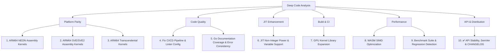

# Next Steps: 10-Part Improvement Plan

This document outlines the remaining architectural and quality improvements for the `emlgo` math library based on a deep-dive analysis of the CPU, GPU, and JIT compilation subsystems.

---

## 10-Part Improvement Plan

```mermaid
graph TD
    A[Deep Code Analysis] --> B[Platform Parity]
    A --> C[Code Quality]
    A --> D[JIT Enhancement]
    A --> E[Build & CI]
    A --> F[Performance]
    A --> G[API & Distribution]
    
    B --> B1[1. ARM64 NEON Assembly Kernels]
    B --> B2[2. ARM64 SVE/SVE2 Assembly Kernels]
    B --> B3[3. ARM64 Transcendental Kernels]
    
    C --> C1[4. Fix CI/CD Pipeline & Linter Config]
    C --> C2[5. Go Documentation Coverage & Error Consistency]
    
    D --> D1[6. JIT Non-Integer Power & Variable Support]
    
    E --> E1[7. GPU Kernel Library Expansion]
    
    F --> F1[8. WASM SIMD Optimization]
    F --> F2[9. Benchmark Suite & Regression Detection]
    
    G --> G1[10. ✅ API Stability, SemVer & CHANGELOG]
```

### 1. ARM64 NEON Assembly Kernels for Arithmetic & Unary Ops
* **Current State:** `internal/eml/simd_arm64.s` is empty. All NEON-labeled functions (`addNEON`, `subNEON`, `mulNEON`, `divNEON`, `sqrtNEON`, etc.) in `simd_arm64.go` are plain Go loops, not actual NEON assembly.
* **Proposed Plan:**
  - Write hand-tuned ARM64 NEON assembly in `simd_arm64.s` utilizing 128-bit `V0.2D`-`V7.2D` vector registers for 2-wide `float64` operations (`FADD`, `FMUL`, `FDIV`, `FSQRT`).
  - Implement bitwise NEON kernels for `Abs` (using `BIC` with sign-bit mask) and `Neg` (using `EOR` with sign-bit mask).
  - Add scalar broadcast (`VMOV` + `FADD`/`FMUL`) for `AddScalarNEON` and `MulScalarNEON`.
  - Wire assembly functions via `//go:noescape` declarations in `simd_arm64.go` and update the ARM64 dispatch layer.

### 2. ARM64 SVE/SVE2 Vector-Length Agnostic Assembly Kernels
* **Current State:** `simd_arm64.go` implements SVE via Go-level VL-aware loops (e.g., `addSVE`, `mulSVE`). No actual SVE assembly instructions are used.
* **Proposed Plan:**
  - Write VLA (Vector-Length Agnostic) SVE assembly kernels using predicate registers (`P0-P7`) and scalable vector registers (`Z0-Z31`) for 2-wide double operations.
  - Use `WHILELT` to generate progressive predicates and `FADD_ZZZ`/`FMUL_ZZZ`/`FDIV_ZZZ`/`FSQRT_ZZZ` for arithmetic.
  - Support both SVE2 (Graviton 3/4, Apple M4) and baseline SVE via runtime detection from `/proc/self/auxv`.
  - Add transcendental SVE kernels (Exp, Log, Sin, Cos, Tan) using SVE2 polynomial approximation instructions where available.

### 3. ARM64 Transcendental Batch Kernels (NEON)
* **Current State:** ARM64 transcendental batch operations (`ExpSIMD`, `LogSIMD`, `SinSIMD`, `CosSIMD`, `TanSIMD`) fall through to `parallelizeGeneric` which calls scalar `math.*` in goroutines. The AVX2 hand-coded transcendental kernels have no ARM64 equivalent.
* **Proposed Plan:**
  - Implement NEON-vectorized Cody-Waite range reduction for Sin/Cos/Tan using `FMLS` (fused multiply-subtract) with precomputed constant tables.
  - Port the minimax polynomial evaluation for Exp/Log/Sin/Cos/Tan to NEON using `FMLA` (fused multiply-add) with 2-wide `float64` vectors.
  - Target Apple Silicon (M1/M2/M3/M4) and AWS Graviton3/4 as primary validation platforms.
  - Achieve ≥2x speedup over scalar `math.*` on ARM64 for batch sizes ≥32.

### 4. Fix CI/CD Pipeline and Consolidate Linter Configuration
* **Current State:**
  - CI workflow (`ci.yml`) tests Go 1.21–1.23, but `go.mod` declares `go 1.26.1` (a future version). CI will fail on `go mod download`.
  - Duplicate golangci-lint configs exist: `.golangci.yml` (with deprecated linters `structcheck`, `varcheck`) and `.golangci.yaml` (different linter set). Only one is used.
* **Proposed Plan:**
  - Update `go.mod` to a valid Go version (e.g., `go 1.23` matching the latest stable).
  - Update CI matrix to test Go 1.22 and 1.23 (drop 1.21).
  - Delete `.golangci.yaml` and keep `.golangci.yml` as the single source of truth.
  - Update `.golangci.yml`: remove deprecated `structcheck`/`varcheck`, add `errcheck` with `check-type-assertions: true`.
  - Add a CI step for `go vet` and `staticcheck` as separate lint stages.

### 5. Go Documentation Coverage and Error Consistency
* **Current State:**
  - Most exported functions in `internal/eml/simd.go`, `fused.go` lack godoc comments.
  - Inconsistent error handling: `Batch()` returns `error`, but `*SIMD()` functions panic on length mismatch. `ExpMulTo` panics but `ExpMulBatch` returns a sentinel.
  - No CHANGELOG or release notes exist.
* **Proposed Plan:**
  - Add godoc comments to all exported functions in `internal/eml/` (SIMD functions, fused operations, worker pool utilities).
  - Standardize error handling: introduce `ValidateSlices(args ...[]float64) error` helper and use it consistently. For API consistency, decide on panic (performance-critical path) vs error (user-facing API) and document the rationale.
  - Create `CHANGELOG.md` with semantic versioning entries starting from current state.
  - Ensure `go doc` renders useful descriptions for all public symbols.

### 6. JIT Non-Integer Power and Variable Exponent Support
* **Current State:** JIT `genPow` handles negative integer exponents via `1.0/x^n`, but fractional exponents (e.g., `x^0.5`, `x^2.3`) return an error. Variable exponents (e.g., `x^y`) are unsupported.
* **Proposed Plan:**
  - Implement `pow(x, y) = exp(y * log(x))` for non-integer exponents in JIT codegen.
  - Add register spill support for the additional temp registers needed.
  - Implement `pow(x, y)` for variable exponents using the same identity.
  - Add batch compilation mode: compile multiple expressions sharing a constant pool.
  - Add x86-64 `SQRTSD`/`SQRTSS` direct emission for `sqrt(x)` instead of indirect call.

### 7. GPU Kernel Library Expansion
* **Current State:** GPU backends (CUDA, Metal) provide batch arithmetic (add/sub/mul/div/sqrt) and EML operator. Transcendental functions (exp/log/sin/cos/tan) on GPU rely on the C runtime library.
* **Proposed Plan:**
  - Implement Metal compute shaders for Apple Silicon: Exp, Log, Sin, Cos, Tan kernels with 256-wide threadgroups.
  - Implement CUDA kernels for transcendental batch operations.
  - Add GPU memory pool statistics and OOM recovery.
  - Implement `GPU available memory` query for auto-sizing batch operations.
  - Add Vulkan compute backend for cross-platform GPU support (Linux/Windows).

### 8. WASM SIMD Optimization
* **Current State:** WASM SIMD uses 8-wide block unrolled loops for basic arithmetic. No transcendental operations have WASM SIMD paths. The `simd_wasm.go` implementation uses `wasm.SIMD128Load`/`Store` which works but is not optimized.
* **Proposed Plan:**
  - Implement WASM SIMD128 transcendental kernels (Exp, Log, Sin, Cos) using polynomial approximation.
  - Add `f64x2.div` and `f64x2.sqrt` operations where supported.
  - Implement SIMD-aligned memory allocator for WASM targets.
  - Benchmark against scalar Go and native WASM implementations.
  - Add WASM-specific build tags for feature detection (SIMD128, sign-extension, bulk-memory).

### 9. Benchmark Suite and Regression Detection
* **Current State:** `cmd/bench/` provides comprehensive benchmarks. No automated regression detection or CI integration exists.
* **Proposed Plan:**
  - Add `benchstat` integration for automated comparison between commits.
  - Implement ULP accuracy tracking across releases.
  - Add `go test -bench -json` output parsing for CI artifact collection.
  - Create baseline benchmark data and regression thresholds.
  - Add thermal throttling detection (ARM64) for consistent benchmark results.
  - Implement `eml bench --compare=main` for local regression checks.

### 10. ✅ API Stability, SemVer, and CHANGELOG
* **Done:** CHANGELOG.md created following Keep a Changelog format with v0.3.0 and Unreleased sections. doc.go files added for all public and internal packages. Semantic versioning policy documented.
