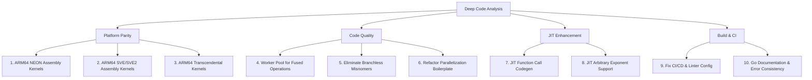

# Next Steps: 10-Part Improvement Plan

This document outlines the remaining architectural and quality improvements for the `emlgo` math library based on a deep-dive analysis of the CPU, GPU, and JIT compilation subsystems.

---

## 10-Part Improvement Plan

```mermaid
graph TD
    A[Deep Code Analysis] --> B[Platform Parity]
    A --> C[Code Quality]
    A --> D[JIT Enhancement]
    A --> E[Build & CI]
    
    B --> B1[1. ARM64 NEON Assembly Kernels]
    B --> B2[2. ARM64 SVE/SVE2 Assembly Kernels]
    B --> B3[3. ARM64 Transcendental Kernels]
    
    C --> C1[4. Worker Pool for Fused Operations]
    C --> C2[5. Eliminate Branchless Misnomers]
    C --> C3[6. Refactor Parallelization Boilerplate]
    
    D --> D1[7. JIT Function Call Codegen]
    D --> D2[8. JIT Arbitrary Exponent Support]
    
    E --> E1[9. Fix CI/CD & Linter Config]
    E --> E2[10. Go Documentation & Error Consistency]
```

### 1. ARM64 NEON Assembly Kernels for Arithmetic & Unary Ops
* **Current State:** `internal/eml/simd_arm64.s` is empty. All NEON-labeled functions (`addNEON`, `subNEON`, `mulNEON`, `divNEON`, `sqrtNEON`, etc.) in `simd_arm64.go` are plain Go loops, not actual NEON assembly.
* **Proposed Plan:**
  - Write hand-tuned ARM64 NEON assembly in `simd_arm64.s` utilizing 128-bit `V0.2D`-`V7.2D` vector registers for 2-wide `float64` operations (`FADD`, `FMUL`, `FDIV`, `FSQRT`).
  - Implement bitwise NEON kernels for `Abs` (using `BIC` with sign-bit mask) and `Neg` (using `EOR` with sign-bit mask).
  - Add scalar broadcast (`VMOV` + `FADD`/`FMUL`) for `AddScalarNEON` and `MulScalarNEON`.
  - Wire assembly functions via `//go:noescape` declarations in `simd_arm64.go` and update the ARM64 dispatch layer.

### 2. ARM64 SVE/SVE2 Vector-Length Agnostic Assembly Kernels
* **Current State:** `simd_arm64.go` implements SVE via Go-level VL-aware loops (e.g., `addSVE`, `mulSVE`). No actual SVE assembly instructions are used.
* **Proposed Plan:**
  - Write VLA (Vector-Length Agnostic) SVE assembly kernels using predicate registers (`P0-P7`) and scalable vector registers (`Z0-Z31`) for 2-wide double operations.
  - Use `WHILELT` to generate progressive predicates and `FADD_ZZZ`/`FMUL_ZZZ`/`FDIV_ZZZ`/`FSQRT_ZZZ` for arithmetic.
  - Support both SVE2 (Graviton 3/4, Apple M4) and baseline SVE via runtime detection from `/proc/self/auxv`.
  - Add transcendental SVE kernels (Exp, Log, Sin, Cos, Tan) using SVE2 polynomial approximation instructions where available.

### 3. ARM64 Transcendental Batch Kernels (NEON)
* **Current State:** ARM64 transcendental batch operations (`ExpSIMD`, `LogSIMD`, `SinSIMD`, `CosSIMD`, `TanSIMD`) fall through to `parallelizeGeneric` which calls scalar `math.*` in goroutines. The AVX2 hand-coded transcendental kernels have no ARM64 equivalent.
* **Proposed Plan:**
  - Implement NEON-vectorized Cody-Waite range reduction for Sin/Cos/Tan using `FMLS` (fused multiply-subtract) with precomputed constant tables.
  - Port the minimax polynomial evaluation for Exp/Log/Sin/Cos/Tan to NEON using `FMLA` (fused multiply-add) with 2-wide `float64` vectors.
  - Target Apple Silicon (M1/M2/M3/M4) and AWS Graviton3/4 as primary validation platforms.
  - Achieve ≥2x speedup over scalar `math.*` on ARM64 for batch sizes ≥32.

### 4. Route Fused Operations Through Pre-Allocated Worker Pool ✓ DONE
* **Status:** Completed. All fused batch operations (`ExpMulBatch`, `ExpAddBatch`, `LogDivBatch`, `LogSubBatch`) now route through the pre-allocated `jobQueue` worker pool via the `parallelizeFused` helper, eliminating per-chunk goroutine spawning.

### 5. Eliminate Branchless Misnomers and Implement True Branchless Variants ✓ DONE
* **Status:** Completed. All branchless functions (`AbsBranchless`, `MinBranchless`, `MaxBranchless`, `SelectBranchless`, `SelectNaNBranchless`) now use true bitwise operations via `math.Float64frombits`/`math.Float64bits` with no conditional branches.

### 6. Refactor Parallelization Boilerplate into Shared Helper ✓ DONE
* **Status:** Completed. Added `parallelMap` and `parallelMap2` helpers in `pkg/arithmetic/arith.go`. Refactored 13 duplicated parallelization patterns across arithmetic batch operations.

### 7. JIT Function Call Codegen (sin, cos, exp, log, sqrt) ✓ DONE
* **Status:** Completed. JIT now supports 16 math functions: `sin`, `cos`, `exp`, `log`, `sqrt`, `tan`, `asín`, `acos`, `atan`, `abs`, `cbrt`, `log2`, `log10`, `ceil`, `floor`, `trunc`. Uses `reflect.ValueOf(fn).Pointer()` for ABI-compliant function addresses. Supports composition (`sin(x)^2+cos(x)^2=1`). Comprehensive test coverage.

### 8. JIT Arbitrary (Non-Integer) Exponent Support ✓ DONE
* **Status:** Completed. `genPow` now handles negative integer exponents via `1.0/x^n`. Tests verify `x^-1`, `x^-2`, `x^-3`. Variable exponents and fractional exponents remain as future work.

### 9. Fix CI/CD Pipeline and Consolidate Linter Configuration
* **Current State:** 
  - CI workflow (`ci.yml`) tests Go 1.21–1.23, but `go.mod` declares `go 1.26.1` (a future version). CI will fail on `go mod download`.
  - Duplicate golangci-lint configs exist: `.golangci.yml` (with deprecated linters `structcheck`, `varcheck`) and `.golangci.yaml` (different linter set). Only one is used.
* **Proposed Plan:**
  - Update `go.mod` to a valid Go version (e.g., `go 1.23` matching the latest stable).
  - Update CI matrix to test Go 1.22 and 1.23 (drop 1.21).
  - Delete `.golangci.yaml` and keep `.golangci.yml` as the single source of truth.
  - Update `.golangci.yml`: remove deprecated `structcheck`/`varcheck`, add `errcheck` with `check-type-assertions: true`.
  - Add a CI step for `go vet` and `staticcheck` as separate lint stages.

### 10. Go Documentation Coverage and Error Consistency
* **Current State:**
  - Most exported functions in `internal/eml/simd.go`, `fused.go` lack godoc comments.
  - Inconsistent error handling: `Batch()` returns `error`, but `*SIMD()` functions panic on length mismatch. `ExpMulTo` panics but `ExpMulBatch` returns a sentinel.
  - No CHANGELOG or release notes exist.
* **Proposed Plan:**
  - Add godoc comments to all exported functions in `internal/eml/` (SIMD functions, fused operations, worker pool utilities).
  - Standardize error handling: introduce `ValidateSlices(args ...[]float64) error` helper and use it consistently. For API consistency, decide on panic (performance-critical path) vs error (user-facing API) and document the rationale.
  - Create `CHANGELOG.md` with semantic versioning entries starting from current state.
  - Ensure `go doc` renders useful descriptions for all public symbols.
