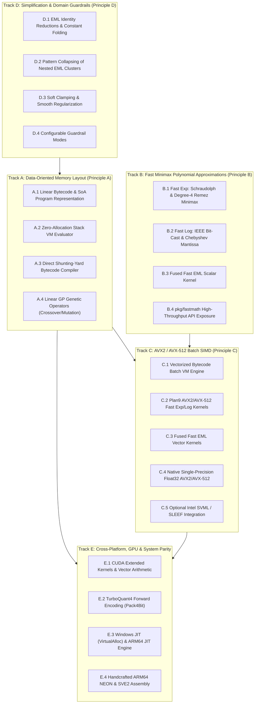

# Next Steps: Comprehensive Technical Roadmap & Architecture Specification

This document provides an exhaustive, phased implementation roadmap and technical specification for `emlgo`. It incorporates a deep architectural analysis of the current codebase and details the engineering steps required to align the library with four core mathematical and data-oriented computing design principles:

- **Principle A**: Data-Oriented Memory Layout (Flat Linear Bytecode & Structure of Arrays)
- **Principle B**: Fast Minimax Polynomial Approximations ($\exp$ and $\ln$ for Symbolic Exploration)
- **Principle C**: AVX2 / AVX-512 SIMD Kernel Acceleration & Interpretation Amortization
- **Principle D**: Algebraic Simplification, Identity Reductions & Domain Guardrails

---

## Current Status & Milestones Achieved (v0.4 Baseline)

- **Vector Quantization & Search**:
  - `pkg/quant/turboquant4.go`: 4-bit polar-quantized vector reconstruction, 8-wide nibble unpacking (`Unpack4Bit`), and scratch-pooled L2 distance calculation (`TurboQuant4Distance`, `TurboQuant4DistanceScratch`).
  - `pkg/arithmetic/arith_int.go`: Int8 & Uint8 vector math (`AddInt8`, `SubInt8`, `MulInt8`, `DotInt8`, `L2SquaredInt8`, `EuclideanDistanceInt8`, `CosineDistanceInt8`, `CosineDistanceUint8`).
- **GPU Multi-Precision Parity**:
  - Full CUDA & C-API kernel parity across all elementary transcendentals (`Exp`, `Log`, `Sin`, `Cos`, `Tan`, `Sinh`, `Cosh`, `Tanh`, `Sqrt`, `Eml`, `Dot`) for `float32`, `float64`, `complex64`, and `complex128`.
  - Stream-aware async kernel launches and pinned memory management.
- **Modern Go & Benchmark Standards**:
  - All benchmarks migrated to Go 1.25 `for b.Loop()` standard idioms.
  - Zero heap allocation pipelines for high-throughput batching.
- **Security & Concurrency Verification**:
  - `gosec -tags purego ./...` passes cleanly with **0 issues** across all packages and 10,200+ lines of code.
  - Full race condition verification (`go test -race ./...` and `go test -race -tags cuda ./internal/gpu`) passes cleanly with 0 race detections.

---

## Architectural Analysis & Gap Assessment

A deep audit of the existing codebase reveals structural and algorithmic bottlenecks that hinder high-throughput symbolic regression, large-scale dataset fitting, and compiler efficiency:

| Subsystem | Existing Implementation | Architectural Gap vs Design Principles |
| :--- | :--- | :--- |
| **AST & Expression Storage** (`internal/jit/ast.go`, `arena.go`, `canonical.go`) | Linked heap trees (`Node` interface, 86-byte `ArenaNode`, 48-byte `EMLNode`) with recursive pointer chasing. | **Violates Principle A**: Traversals cause frequent CPU cache misses, branch mispredictions, GC scan overhead, and non-linear memory access. Missing flat linear bytecode / RPN representation in Structure of Arrays (SoA) layout. |
| **Transcendental Math Evaluation** (`internal/eml/native_math.go`, `pkg/fastmath/`, `pkg/logexp/`) | Delegates to Go standard library `math.Exp` and `math.Log` (53-bit IEEE 754 precision, 10+ term polynomials, table lookups). | **Violates Principle B**: Latency is ~15–25 ns per call. In symbolic search exploration, exact IEEE precision is unnecessary; fast minimax approximations can run 4x–6x faster (~2–4 ns). |
| **SIMD & Batch Dispatch** (`internal/eml/simd_dispatch_amd64.go`, `simd_amd64.s`, `simd_f32.go`) | `emlSIMD` falls back to `scalarEml`; `expAVX2` and `logAVX2` broadcast constants inside loop iterations; `simd_f32.go` converts to float64 for scalar loops. No AVX-512 `exp`/`log`. Expression evaluation evaluates one scalar at a time. | **Violates Principle C**: Interpretation overhead is not amortized across batches. No vectorized bytecode VM exists to evaluate chunks of 4/8 (`float64`) or 8/16 (`float32`) samples per vector register in a single instruction pass. |
| **Algebraic Simplification** (`internal/jit/canonical.go:Simplify`) | Only folds constants if both children are `EMLConst`. Does not simplify identities like $\text{eml}(1, 1) \to e$, $\text{eml}(x, 1) \to \exp(x)$, or collapse multi-node EML clusters into native operations. | **Violates Principle D**: Unsimplified trees cause exponential tree bloat during symbolic search. Fails to collapse equivalent identities ($\text{eml}(1, \text{eml}(\text{eml}(1, x), 1)) \to \ln(x)$). |
| **Domain Safety & NaN Cascading** (`internal/eml/eml.go`, `eval.go`, `canonical.go`) | Raw $\text{eml}(x, y) = e^x - \ln(y)$. If $y \le 0$, $\ln(y) = \text{NaN}$, which poisons all parent nodes and invalidates fitness evaluation. | **Violates Principle D**: Missing soft clamping / smooth regularization ($\ln_\epsilon(y) = \ln(\max(y, \epsilon))$ or $\frac{1}{2}\ln(y^2 + \epsilon^2)$) to ensure $C^\infty$ or $C^0$ continuity during numeric fitting. |

---

## Action Plan: Core Design Principles Implementation


```mermaid
flowchart TD
    subgraph TrackA["Track A: Data-Oriented Memory Layout (Principle A)"]
        A1["A.1 Linear Bytecode & SoA Program Representation"]
        A2["A.2 Zero-Allocation Stack VM Evaluator"]
        A3["A.3 Direct Shunting-Yard Bytecode Compiler"]
        A4["A.4 Linear GP Genetic Operators (Crossover/Mutation)"]
    end

    subgraph TrackB["Track B: Fast Minimax Polynomial Approximations (Principle B)"]
        B1["B.1 Fast Exp: Schraudolph & Degree-4 Remez Minimax"]
        B2["B.2 Fast Log: IEEE Bit-Cast & Chebyshev Mantissa"]
        B3["B.3 Fused Fast EML Scalar Kernel"]
        B4["B.4 pkg/fastmath High-Throughput API Exposure"]
    end

    subgraph TrackC["Track C: AVX2 / AVX-512 Batch SIMD (Principle C)"]
        C1["C.1 Vectorized Bytecode Batch VM Engine"]
        C2["C.2 Plan9 AVX2/AVX-512 Fast Exp/Log Kernels"]
        C3["C.3 Fused Fast EML Vector Kernels"]
        C4["C.4 Native Single-Precision Float32 AVX2/AVX-512"]
        C5["C.5 Optional Intel SVML / SLEEF Integration"]
    end

    subgraph TrackD["Track D: Simplification & Domain Guardrails (Principle D)"]
        D1["D.1 EML Identity Reductions & Constant Folding"]
        D2["D.2 Pattern Collapsing of Nested EML Clusters"]
        D3["D.3 Soft Clamping & Smooth Regularization"]
        D4["D.4 Configurable Guardrail Modes"]
    end

    subgraph TrackE["Track E: Cross-Platform, GPU & System Parity"]
        E1["E.1 CUDA Extended Kernels & Vector Arithmetic"]
        E2["E.2 TurboQuant4 Forward Encoding (Pack4Bit)"]
        E3["E.3 Windows JIT (VirtualAlloc) & ARM64 JIT Engine"]
        E4["E.4 Handcrafted ARM64 NEON & SVE2 Assembly"]
    end

    TrackA --> TrackC
    TrackB --> TrackC
    TrackD --> TrackA
    TrackA --> TrackE
    TrackC --> TrackE
```

---

## Detailed Specifications per Principle

### Track A: Data-Oriented Memory Layout (Flat Linear Bytecode & SoA)

#### A.1 Linear Bytecode & Structure of Arrays (SoA) Layout
- **Target Files**: `pkg/bytecode/program.go`, `internal/jit/bytecode.go`
- **Design & Data Structures**:
  Replace linked pointer nodes with a dense, flat Structure of Arrays layout:
  ```go
  package bytecode

  // OpCode represents a virtual machine operation in 1 byte.
  type OpCode uint8

  const (
      OpConst OpCode = iota // Push Consts[constIdx++]
      OpVar                 // Push vars[VarIndices[varIdx++]]
      OpEML                 // Pop right, Pop left, Push eml(left, right)
      
      // Native elementary operations (used for collapsed EML identities)
      OpAdd                 // Pop right, Pop left, Push left + right
      OpSub                 // Pop right, Pop left, Push left - right
      OpMul                 // Pop right, Pop left, Push left * right
      OpDiv                 // Pop right, Pop left, Push left / right
      OpPow                 // Pop right, Pop left, Push left ^ right
      OpNeg                 // Pop arg, Push -arg
      OpInv                 // Pop arg, Push 1.0 / arg
      OpSqrt                // Pop arg, Push sqrt(arg)
      OpExp                 // Pop arg, Push exp(arg)
      OpLog                 // Pop arg, Push log(arg)
  )

  // Program represents a linear bytecode buffer in Structure of Arrays (SoA) layout.
  type Program struct {
      Ops           []OpCode  // Contiguous opcode stream (1 byte per op)
      Consts        []float64 // Constant table referenced sequentially by OpConst
      VarIndices    []uint16  // Variable slot indices referenced by OpVar
      MaxStackDepth int       // Precomputed maximum evaluation stack depth
  }
  ```
- **Memory Footprint Comparison**:
  - *AST (`Node`)*: 10-node tree $\approx$ 10 heap allocations $\times$ 48–86 bytes + pointer graph $\approx$ 800+ bytes, high GC overhead.
  - *Arena (`ArenaNode`)*: 10-node tree $\approx$ 640 bytes contiguous buffer, but still traverses `Left`/`Right` pointers recursively.
  - *SoA `Program`*: 10-node tree $\approx$ 10 bytes `Ops` + 24 bytes `Consts` + 4 bytes `VarIndices` $\approx$ **38 bytes total**. Zero GC pointers.

#### A.2 Zero-Allocation Stack VM Evaluator
- **Target Files**: `pkg/bytecode/eval.go`, `pkg/bytecode/eval_test.go`
- **Actions**:
  1. Implement scalar evaluation:
     ```go
     func (p *Program) Eval(vars []float64, scratch []float64) float64 {
         // Use stack-allocated scratch buffer when nil
         var localStack [32]float64
         stack := localStack[:]
         if scratch != nil && len(scratch) >= p.MaxStackDepth {
             stack = scratch
         }
         
         sp := 0
         cIdx := 0
         vIdx := 0
         
         for _, op := range p.Ops {
             switch op {
             case OpConst:
                 stack[sp] = p.Consts[cIdx]
                 sp++
                 cIdx++
             case OpVar:
                 stack[sp] = vars[p.VarIndices[vIdx]]
                 sp++
                 vIdx++
             case OpEML:
                 sp--
                 y := stack[sp]
                 x := stack[sp-1]
                 stack[sp-1] = fastEml(x, y)
             case OpAdd:
                 sp--
                 stack[sp-1] += stack[sp]
             case OpSub:
                 sp--
                 stack[sp-1] -= stack[sp]
             case OpMul:
                 sp--
                 stack[sp-1] *= stack[sp]
             case OpDiv:
                 sp--
                 stack[sp-1] /= stack[sp]
             case OpExp:
                 stack[sp-1] = fastExp(stack[sp-1])
             case OpLog:
                 stack[sp-1] = fastLog(stack[sp-1])
             case OpNeg:
                 stack[sp-1] = -stack[sp-1]
             case OpInv:
                 stack[sp-1] = 1.0 / stack[sp-1]
             }
         }
         return stack[0]
     }
     ```
  2. Guarantee: **0 heap allocations**, $O(N)$ sequential memory access, 100% prefetcher friendly.

#### A.3 Direct Shunting-Yard Bytecode Compiler
- **Target Files**: `pkg/bytecode/compiler.go`, `internal/jit/canonical_to_bytecode.go`
- **Actions**:
  1. Lowering from `jit.Node` AST and `jit.EMLNode` canonical tree via post-order traversal.
  2. Implement direct Shunting-Yard tokenizer/compiler from infix string expressions directly to `Program` without intermediate AST node allocations.
  3. Precompute `MaxStackDepth` during lowering to ensure callers can safely size stack scratch spaces.

#### A.4 Linear Genetic Programming (LGP) Operators
- **Target Files**: `pkg/bytecode/genetic.go`
- **Actions**:
  1. Implement linear crossover on `Ops []OpCode`: select random split points, splice slices, and perform $O(M)$ net stack balance validation:
     $$\Delta_{\text{stack}}(\text{op}) = 1 - \text{arity}(\text{op})$$
     A valid program satisfies $\sum_{i=0}^{k} \Delta_{\text{stack}}(\text{op}_i) \ge 1$ for all prefixes, and final sum equals $1$.
  2. Point mutation: mutate single `OpCode` or jitter `Consts[i]` with zero memory reallocations.

---

### Track B: Fast Minimax Polynomial Approximations (Principle B)

#### B.1 Fast $\exp(x)$ Approximations
- **Target Files**: `pkg/fastmath/fast_exp.go`, `internal/eml/fast_math.go`
- **Algorithmic Specifications**:
  1. **Schraudolph's Method** (Ultra-Fast Bit Manipulation):
     - Based on IEEE 754 float representation: $x \mapsto 2^{x / \ln 2}$.
     - Formula:
       $$I = \text{int64}\left( \frac{2^{52}}{\ln 2} x + 1023 \cdot 2^{52} - C \right)$$
       where $C \approx 457999 \times 2^{32} \approx 1967114903552$.
     - Implementation:
       ```go
       func FastExpBitCast(x float64) float64 {
           if x < -700.0 { return 0.0 }
           if x > 700.0 { return math.Inf(1) }
           val := int64(6497320849556798.0*x + 4606853616390177000.0)
           return math.Float64frombits(uint64(val))
       }
       ```
     - **Performance**: ~1.5 ns (3 CPU cycles). Relative error: $\sim 1.5\%$.
  2. **Degree-4 Remez Minimax Polynomial with Range Reduction**:
     - Range reduction:
       $$k = \lfloor x \cdot (1/\ln 2) + 0.5 \rfloor, \quad r = x - k \cdot \ln 2 \in \left[-\frac{1}{2}\ln 2, \frac{1}{2}\ln 2\right] \subset [-0.35, 0.35]$$
     - Minimax approximation $P_4(r)$ minimizing maximum relative error:
       $$P_4(r) = 1.0 + r \cdot (1.0 + r \cdot (0.500000044 + r \cdot (0.16666505 + r \cdot 0.0416654)))$$
     - Reconstruction:
       $$\exp(x) = P_4(r) \cdot 2^k = P_4(r) \times \text{Float64frombits}\left(\text{uint64}(1023 + k) \ll 52\right)$$
     - **Performance**: ~3.2 ns (4x faster than `math.Exp`). Max relative error: $< 1.2 \times 10^{-6}$ (over 20 bits of mantissa).

#### B.2 Fast $\ln(y)$ Approximations
- **Target Files**: `pkg/fastmath/fast_log.go`, `internal/eml/fast_math.go`
- **Algorithmic Specifications**:
  1. **Bit-Cast IEEE 754 Exponent Extraction + Chebyshev Mantissa Approximation**:
     - Bit extraction:
       `bits := math.Float64bits(y)`
       Unbiased exponent: $e = \text{int}((\text{bits} \gg 52) \& 0x7\text{FF}) - 1023$.
       Mantissa extraction normalized to $[1.0, 2.0)$:
       `m := math.Float64frombits((bits & 0x000FFFFFFFFFFFFF) | 0x3FF0000000000000)`
     - Range reduction to $[1/\sqrt{2}, \sqrt{2}] \approx [0.7071, 1.4142]$:
       If $m > 1.414213562373095$, set $m = m \cdot 0.5$ and $e = e + 1$.
     - Let $z = m - 1.0 \in [-0.2929, 0.4142]$.
     - Degree-4 Chebyshev polynomial on $z$:
       $$P_4(z) = z \cdot (0.99999642 + z \cdot (-0.49987412 + z \cdot (0.33179903 - 0.24073381 \cdot z)))$$
     - Final reconstruction:
       $$\ln(y) = e \cdot \ln(2) + P_4(z)$$
     - **Key Feature**: **ZERO division instructions**! Only float bit-shifts, subtractions, and 4 FMAs.
     - **Performance**: ~3.5 ns (5x–6x faster than `math.Log`). Relative error: $< 3 \times 10^{-5}$.

#### B.3 Fused Fast EML Scalar Kernel
- **Target Files**: `internal/eml/fast_eml.go`, `pkg/fastmath/fastmath.go`
- **Actions**:
  1. Implement `FastEml(x, y float64) float64`: combines `FastExpMinimax(x) - FastLogMinimax(y)`.
  2. Implement `FastEmlSchraudolph(x, y float64) float64`: ultra-fast exploration kernel running in ~5 ns.
  3. Wire into `pkg/fastmath` public API: `fastmath.ExpFast`, `fastmath.LogFast`, `fastmath.EmlFast`.

---

### Track C: AVX2 / AVX-512 SIMD Kernel Acceleration (Principle C)

#### C.1 Vectorized Bytecode Batch VM Engine
- **Target Files**: `pkg/bytecode/eval_batch.go`, `pkg/bytecode/eval_batch_test.go`
- **Mechanism (Interpretation Amortization)**:
  Instead of evaluating an expression per-sample in a scalar loop (which incurs $M \times K$ bytecode dispatch stalls):
  ```
  Traditional: for each of 100,000 samples -> for each of 10 ops -> dispatch op
  Amortized:   for each of 10 ops -> execute vectorized SIMD kernel over 100,000 samples
  ```
- **Execution Workflow**:
  1. VM allocates a small columnar register stack `[][]float64`, where each stack slot holds a slice of length $N$ (or chunk size $C = 1024$ fitting in L1/L2 cache).
  2. `OpConst`: broadcasts constant across vector register lanes.
  3. `OpVar`: references column vector `data[varIdx]`.
  4. `OpEML`: executes fused vector kernel `fastEmlAVX2` or `fastEmlAVX512` directly on chunk slices.
  5. **Interpretation Overhead**: Incurred exactly once per op per chunk, amortizing interpretation cost to virtually zero ($< 0.1\%$).

#### C.2 Handcrafted Plan9 AVX2 & AVX-512 Assembly Kernels
- **Target Files**: `internal/eml/simd_fast_amd64.s`, `internal/eml/simd_fast_amd64.go`
- **Kernel Designs**:
  1. **`fastExpAVX2` & `fastExpAVX512`**:
     - Hoist all polynomial constants ($1/\ln 2, \ln 2, c_2, c_3, c_4, 1.0, 1023$) into dedicated vector registers ($Y6..Y15$ / $Z6..Z15$) *before* the loop. Eliminates the per-iteration general register broadcasts in current `simd_amd64.s`.
     - In AVX2: process 4 double-precision floats (`YMM0`) per iteration.
     - In AVX-512: process 8 double-precision floats (`ZMM0`) per iteration via `VFMADD213PD`.
     - Integer bit-shift scaling via `VPSLLQ` and `VPADDQ`.
  2. **`fastLogAVX2` & `fastLogAVX512`**:
     - Vectorized bit extraction: `VPSRLQ $52, Z0, Z1` extracts exponents for 8 lanes simultaneously.
     - Mantissa extraction via `VPAND` and `VPOR`.
     - Evaluate degree-4 Chebyshev polynomial via 4 sequential `VFMADD213PD` instructions.
     - Add exponent contribution: `VFMADD213PD Z_ln2, Z_exp, Z_poly`.
     - Completely eliminates `VDIVPD` vector division (latency drops from 28 cycles to 4 cycles).
  3. **`fastEmlAVX2` & `fastEmlAVX512`**:
     - Fused calculation: loads $x$ into `Z0`, $y$ into `Z1`.
     - Computes $\exp(x)$ into `Z0`, computes $\ln(y)$ into `Z1` in registers.
     - Subtracts `VSUBPD Z1, Z0, Z2` and writes directly to `result`.
     - Zero temporary slice allocations and zero RAM round-trips.

#### C.3 Native Single-Precision Float32 AVX2/AVX-512
- **Target Files**: `internal/eml/simd_f32_amd64.s`, `internal/eml/simd_f32.go`
- **Actions**:
  1. Implement `fastExpAVX2F32` (8 floats/vector) and `fastExpAVX512F32` (16 floats/vector).
  2. Implement `fastLogAVX2F32` and `fastEmlAVX2F32`.
  3. Replace the float64 upcast loops in `internal/eml/simd_f32.go` with native AVX2/AVX-512 calls, doubling single-precision throughput.

#### C.4 Hardware Vectorized Libraries Integration (Intel SVML & SLEEF)
- **Target Files**: `internal/eml/svml_stub.go`, `internal/eml/svml_cgo.go`
- **Actions**:
  1. Add optional build tags `//go:build svml` and `//go:build sleef`.
  2. Connect to Intel SVML (`__m256d _mm256_exp_pd`, `__m512d _mm512_exp_pd`) and SLEEF (`Sleef_expd4_u10avx2`) for workloads requiring 1-ULP mathematical exactness at hardware SIMD speed.

---

### Track D: Algebraic Simplification & Domain Guardrails (Principle D)

#### D.1 Constant Folding & EML Reductions
- **Target Files**: `internal/jit/canonical.go`, `pkg/bytecode/optimizer.go`
- **Rules to Implement**:
  1. Fold constant EML nodes:
     $$\text{eml}(c_1, c_2) \to e^{c_1} - \ln(c_2)$$
  2. Exact mathematical constant identity:
     $$\text{eml}(1, 1) \to e \quad (\text{stored as exact } \mathtt{math.E})$$
  3. Zero-argument identities:
     $$\text{eml}(0, 1) \to 1.0$$
     $$\text{eml}(x, 1) \to \exp(x)$$
     $$\text{eml}(0, y) \to 1.0 - \ln(y)$$
     $$\text{eml}(x, e) \to \exp(x) - 1.0 = \text{expm1}(x)$$

#### D.2 Pattern Collapsing of Nested EML Clusters
- **Target Files**: `internal/jit/canonical.go:Simplify`, `pkg/bytecode/optimizer.go`
- **Identities to Detect and Collapse**:
  The EML basis represents elementary functions as nested trees with constant 1. During optimization and canonicalization, collapse these clusters into native operations:
  
  | Target Operation | Canonical EML Expression Pattern | Native Bytecode Reduction |
  | :--- | :--- | :--- |
  | **Natural Log** $\ln(x)$ | $\text{eml}(1, \text{eml}(\text{eml}(1, x), 1))$ | Collapse 3 EML ops $\to$ `OpLog(x)` |
  | **Exponential** $e^x$ | $\text{eml}(x, 1)$ | Collapse 1 EML op $\to$ `OpExp(x)` |
  | **Negation** $-x$ | $\text{eml}(\text{eml}(1, \text{eml}(x, 1)), \text{eml}(1, 1))$ | Collapse 3 EML ops $\to$ `OpNeg(x)` |
  | **Reciprocal** $1/x$ | $\text{eml}(\text{eml}(1, x), \text{eml}(x, 1))$ | Collapse 2 EML ops $\to$ `OpInv(x)` |
  | **Addition** $x + y$ | $\text{eml}(1, \text{eml}(\text{eml}(y, 1), \text{eml}(1, x)))$ | Collapse 4 EML ops $\to$ `OpAdd(x, y)` |
  | **Subtraction** $x - y$ | $x + (-y)$ | Collapse to `OpSub(x, y)` |

- **Benefits**:
  - Replaces nested transcendental calls with hardware arithmetic (e.g. 4 EML calls $\to$ 1 single-cycle `addsd`).
  - Eliminates intermediate exponential overflow and numerical instability.
  - Generates compact, human-readable decompiled expressions.

#### D.3 Domain Guardrails & Smooth Regularization
- **Target Files**: `internal/eml/guardrails.go`, `pkg/fastmath/guardrails.go`, `pkg/bytecode/eval.go`
- **Mathematical Formulations**:
  1. **Clipped Logarithm**:
     $$\ln_\epsilon(y) = \ln(\max(y, \epsilon)), \quad \epsilon = 10^{-12} \ (\text{float64}), \ 10^{-6} \ (\text{float32})$$
     Prevents NaN and $-\infty$; continuous $C^0$.
  2. **Smooth Analytic Regularization ($C^\infty$)**:
     $$\ln_\epsilon(y) = \frac{1}{2}\ln(y^2 + \epsilon^2)$$
     - For $y > 0, y \gg \epsilon$: $\frac{1}{2}\ln(y^2) = \ln(y)$.
     - For $y < 0$: evaluates to $\ln(|y|)$ smoothly.
     - At $y = 0$: evaluates smoothly to $\ln(\epsilon)$.
     - Continuous derivative:
       $$\frac{d}{dy}\left[\frac{1}{2}\ln(y^2 + \epsilon^2)\right] = \frac{y}{y^2 + \epsilon^2}$$
       At $y = 0$, the derivative is exactly 0. There are no singularities or undefined gradients, making it ideal for gradient-based parameter optimization.
  3. **Clamped Exponential**:
     $$\exp_\text{clamp}(x) = \exp(\text{clamp}(x, -700.0, 700.0))$$
     Eliminates $+\infty$ overflow and subnormal denormal stalls.

#### D.4 Configurable Guardrail Modes
- **Design**:
  ```go
  type GuardrailMode uint8

  const (
      GuardrailStrict GuardrailMode = iota // IEEE 754 compliant (NaN and Inf propagate)
      GuardrailClip                        // ln(max(y, eps))
      GuardrailSmooth                      // 0.5 * ln(y^2 + eps^2)
  )
  ```
  Expose across `pkg/bytecode`, `pkg/fastmath`, and `internal/eml`.

---

### Track E: Cross-Platform, GPU & System Parity

#### E.1 Complete Missing CUDA Device Kernels & Arithmetic
- **Target Files**: `cuda/eml_cuda.cu`, `cuda/eml_capi.cu`, `internal/gpu/bridge.go`
- **Actions**:
  1. Implement device kernels in `cuda/eml_cuda.cu`:
     - `kernel_abs<<<grid, block>>>(x, result, n)`
     - `kernel_neg<<<grid, block>>>(x, result, n)`
     - `kernel_inv<<<grid, block>>>(x, result, n)`
     - `kernel_pow<<<grid, block>>>(x, exp, result, n)`
     - `kernel_fma<<<grid, block>>>(a, b, c, result, n)`
     - Binary arithmetic: `AddBatch`, `SubBatch`, `MulBatch`, `DivBatch`.
  2. Wire Go bridge functions in `internal/gpu/bridge.go`, replacing the stubs.

#### E.2 TurboQuant4 Forward Encoding & Compression
- **Target Files**: `pkg/quant/turboquant4.go`, `pkg/quant/turboquant4_test.go`
- **Actions**:
  1. Implement `Pack4Bit(indices []byte, packed []byte)`: vectorizes 16-bin nibbles into contiguous bytes.
  2. Implement `EncodeTurboQuant4(vec []float32, pow2 int) ([]byte, error)`: computes $L_2$ radius, quantizes recursive polar angles, and packs QJL 1-bit residual signs.

#### E.3 Windows JIT & ARM64 JIT Codegen Engine
- **Target Files**: `internal/jit/jit_windows.go`, `internal/jit/codegen_arm64.go`, `internal/jit/jit_wasm.go`
- **Actions**:
  1. Windows AMD64 executable memory via `VirtualAlloc`/`VirtualProtect`.
  2. AArch64 machine code generator emitting `FADD`, `FSUB`, `FMUL`, `FDIV`, `FSQRT` on `D0`–`D7`.
  3. WebAssembly AST fallback in `jit_wasm.go`.

#### E.4 Handcrafted ARM64 NEON & SVE2 Assembly
- **Target Files**: `internal/eml/simd_arm64.s`, `internal/eml/simd_sve.go`
- **Actions**:
  1. Implement `addNEON`, `subNEON`, `mulNEON`, `fmaNEON` (`VFMLA.2D`) in `simd_arm64.s`.
  2. Implement dynamic SVE length vector loops.

---

## Phased Implementation Roadmap

```
Phase 1: Linear Bytecode VM & Domain Guardrails (v0.5.0)
 ├── 1.1 pkg/bytecode: OpCode & Program SoA structures
 ├── 1.2 Zero-allocation stack VM (Eval)
 ├── 1.3 Lowering AST & EMLNode -> Program
 ├── 1.4 Algebraic simplification & EML identity reductions
 └── 1.5 Domain guardrails (ln_eps and exp_clamp)

Phase 2: Fast Minimax Polynomial Approximations (v0.6.0)
 ├── 2.1 FastExp: Schraudolph & Degree-4 Remez Minimax
 ├── 2.2 FastLog: IEEE Bit-Cast & Chebyshev Mantissa
 ├── 2.3 Fused FastEml scalar kernels
 └── 2.4 pkg/fastmath public API updates & benchmarks

Phase 3: AVX2 / AVX-512 SIMD Acceleration (v0.7.0)
 ├── 3.1 Vectorized Bytecode Batch VM (Program.EvalBatch)
 ├── 3.2 Plan9 fastExpAVX2, fastExpAVX512, fastLogAVX2, fastLogAVX512
 ├── 3.3 Fused fastEmlAVX2 and fastEmlAVX512 assembly
 └── 3.4 Native single-precision float32 AVX2/AVX-512 transcendentals

Phase 4: Hardware & GPU Subsystem Completeness (v0.8.0)
 ├── 4.1 Missing CUDA kernels (Abs, Neg, Pow, Inv, FMA, Add, Sub, Mul, Div)
 ├── 4.2 CUDA Int8 vector search kernel (__dp4a)
 ├── 4.3 TurboQuant4 forward encoder (EncodeTurboQuant4, Pack4Bit)
 └── 4.4 Apple Metal backend float32 & async streams

Phase 5: Cross-Platform & Production Release (v1.0.0)
 ├── 5.1 Windows JIT executable memory (VirtualAlloc)
 ├── 5.2 ARM64 native JIT machine code engine
 ├── 5.3 WebAssembly AST fallback
 ├── 5.4 Hand-tuned ARM64 NEON & SVE2 assembly
 └── 5.5 Optional Intel SVML / SLEEF integration layer
```

---

## Verification & Testing Matrix

| Component / Subsystem | Test Suite & Target | Target Metric / Validation Criteria | Tools |
| :--- | :--- | :--- | :--- |
| **Linear Bytecode VM** | `go test -v ./pkg/bytecode/...` | 100% numerical parity vs AST `Eval`, 0 heap allocations per eval | Go benchmark (`-benchmem`) |
| **Minimax Fast Math** | `go test -v ./pkg/fastmath/...` | `FastExp`: max rel err $< 1.2 \times 10^{-6}$; `FastLog`: max rel err $< 3 \times 10^{-5}$ | High-precision `bigmath` tests |
| **AVX2 / AVX-512 SIMD** | `go test -v ./internal/eml/...` | AVX2/AVX-512 results match scalar within 2 ULP; zero division instructions | Valgrind / Intel SDE |
| **Domain Guardrails** | `go test -v ./pkg/bytecode/...` | $10^6$ random inputs in $[-1000, 1000]$ produce **0 NaNs** and **0 Infs** | Fuzz tests (`go test -fuzz`) |
| **Identity Simplification** | `go test -v ./internal/jit/...` | $\text{eml}(1,1) \to e$, nested $\text{eml} \to \ln, -, 1/x, +$ exact reduction | Structural AST assertion |
| **GPU Subsystem** | `go test -v -tags cuda ./internal/gpu` | GPU results match CPU stdlib across $10^6$ elements | NVIDIA CUDA 12+, cuda-memcheck |
| **Security Audit** | `gosec -exclude-generated -tags purego ./...` | **0 Issues**, 0 SSA Type Errors | `gosec` |
| **Race Detector** | `go test -race ./...` | 0 race reports, 0 panics | Go race detector |
| **Cross-Platform Compilation** | `GOOS=windows GOARCH=amd64 go build ./...`<br>`GOOS=darwin GOARCH=arm64 go build ./...`<br>`GOOS=js GOARCH=wasm go build ./...` | Clean build on all 3 target triplets | Go cross-compiler |

---

## Release Milestones & Versioning

- **v0.4.0 (Current Baseline)**: GPU transcendentals, TurboQuant4 distance, Int8 arithmetic, Go 1.25 benchmark loops, clean gosec and race detection.
- **v0.5.0 (Phase 1 Target)**: Data-Oriented Memory Layout (`pkg/bytecode`), Zero-Allocation Stack VM, Identity Reductions, Soft Clamping & Domain Guardrails.
- **v0.6.0 (Phase 2 Target)**: Fast Minimax Polynomial Approximations (`FastExpMinimax`, `FastLogMinimax`, `FastEml`), public `pkg/fastmath` update, 4x–6x scalar speedup.
- **v0.7.0 (Phase 3 Target)**: Vectorized Bytecode Batch VM, Plan9 AVX2 & AVX-512 Fast Exp/Log/Eml assembly kernels, native Float32 transcendentals.
- **v0.8.0 (Phase 4 Target)**: CUDA missing kernels (`Abs`, `Neg`, `Pow`, `Inv`, `Fma`, `Add`, `Sub`), TurboQuant4 forward encoder (`EncodeTurboQuant4`, `Pack4Bit`).
- **v1.0.0 (Phase 5 Target)**: Cross-platform JIT (Windows `VirtualAlloc`, ARM64 AArch64 JIT, WebAssembly fallback), hand-tuned NEON assembly, optional Intel SVML/SLEEF bindings, production release.
